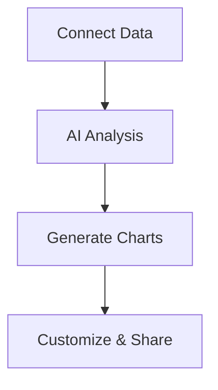

## Overview

Baza Analytics provides powerful tools to transform your raw data into actionable insights. You can query data using natural language, explore visualizations with AI assistance, collaborate in real-time on dashboards, and share reports effortlessly. These features work together to streamline your analytics workflow.

<Columns cols={2}>
  <Card title="Natural Language Queries" icon="search" href="#natural-language-queries">
    Ask questions in plain English and get instant results.
  </Card>
  <Card title="AI Data Exploration" icon="zap" href="#ai-exploration">
    Automatically generate charts and detect patterns.
  </Card>
  <Card title="Real-time Collaboration" icon="users" href="#collaboration">
    Work together on live dashboards with your team.
  </Card>
  <Card title="Report Sharing" icon="share-2" href="#sharing">
    Export and distribute insights securely.
  </Card>
</Columns>

## Natural Language Queries

Interact with your data using everyday language instead of writing complex SQL. Connect your data sources like PostgreSQL or Google Sheets, then type questions like "What were sales last quarter?" Baza Analytics translates them into optimized queries.

<Tabs>
  <Tab title="Natural Language" icon="message-circle">
    Type your question directly in the query bar.
  </Tab>
  <Tab title="SQL Equivalent" icon="code">
    View the generated SQL for verification.
  </Tab>
</Tabs>

<CodeGroup tabs="Natural Language,SQL">
  ```
  Show monthly revenue by region for 2023.
  ```
  ```sql
  SELECT 
    region, 
    SUM(revenue) as monthly_revenue
  FROM sales 
  WHERE year = 2023 
  GROUP BY region 
  ORDER BY monthly_revenue DESC;
  ```
</CodeGroup>

<Callout kind="tip">
  Start with simple questions to build confidence. Baza refines results based on your data schema.
</Callout>

## AI-Powered Data Exploration and Visualization

Leverage AI to uncover insights automatically. Upload datasets or connect live sources, and Baza suggests relevant charts, detects anomalies, and forecasts trends.

### Quick Exploration Steps

<Steps>
  <Step title="Connect Data" icon="database">
    Link your source via the integrations panel.
  </Step>
  <Step title="Ask AI" icon="sparkles">
    Click "Explore with AI" and describe your goal, like "Visualize user growth."
  </Step>
  <Step title="Refine Insights" icon="edit-3">
    Drag to adjust charts or apply filters.
  </Step>
</Steps>



## Real-time Collaboration on Dashboards

Build shared dashboards where team members edit simultaneously. Changes appear instantly, with activity feeds to track contributions.

Use the collaboration API to embed dashboards:

<CodeGroup tabs="JavaScript,Python">
  ```javascript
  const dashboardId = 'dash-12345';
  const embedUrl = `https://app.bazaanalytics.com/embed/${dashboardId}?token=YOUR_TOKEN`;

  embedIframe(embedUrl);
  ```
  ```python
  import requests

  dashboard_id = "dash-12345"
  token = "YOUR_TOKEN"
  embed_url = f"https://app.bazaanalytics.com/embed/{dashboard_id}?token={token}"
  print(embed_url)
  ```
</CodeGroup>

## Sharing and Exporting Reports

Distribute insights via links, PDFs, or embeds. Set permissions for view-only or edit access.

<Expandable title="Advanced Sharing Options" default-open="false">
  Choose formats like PNG, CSV, or interactive HTML. Schedule automated exports to email or Slack.
</Expandable>

<Callout kind="success">
  All shares include audit logs for compliance.
</Callout>

Link these features with [Quickstart](/quickstart) for hands-on setup.